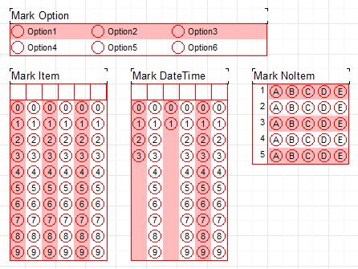

# FastReport-OMR-Object
Optical Mark Reader Object for FastReport

# OMR Object 
- TfrxMarkDateTime
- TfrxMarkItem
- TfrxMarkNoItem
- TfrxMarkOptionItem
  
# Object Properties
- CellHeader: shape of cell header
- Cell: shape of cell item
- CellItems: text of cell item
- CellLineItems: custom text of cell item
- DefaultValues: default value for item separated by ":"
- Orientation: orientation of object cell item
- StripPosition: position of strip color
- StripColor: color of strip

# Demo

